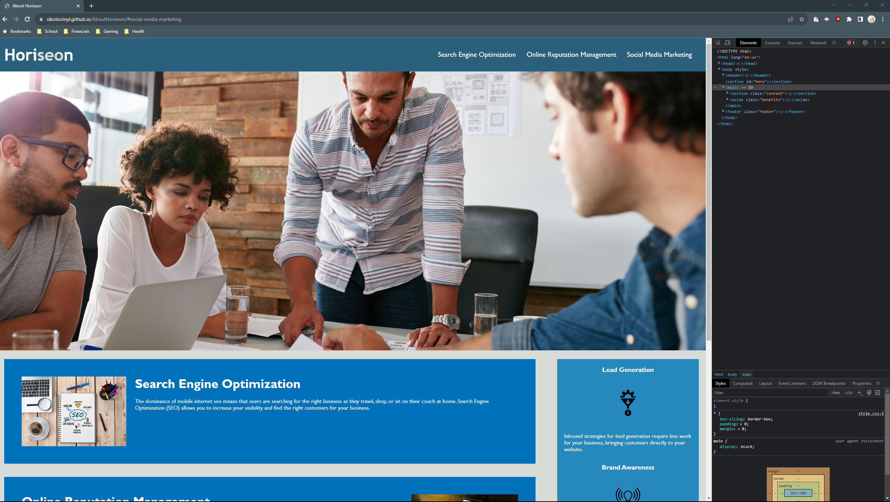

# <Sikotic Horiseon Page Code Overhaul>

## Description

This project was to take existing code for a company page and overhaul it on the HTML ans CSS areas so that the page looks the same but is more user accessible and contains more semantic elements. I took on this project to get a better handle on HTML and CSS, it helped me work through and notice better how the HTML and CSS elements affect eachother while also seeing how overwhelming lots of unnecessicary code can be. 

One of the first issues that I ran into with this project was trying to get the link to work, as I began fixing the HTML sheet to include more semantic elements and be easier to read it broke the link pretty quickly. I found myself fighting with that link multiple times throughout the process as I would change this or that or the other and where the link had been working it would just stop again.

I found the best way to get past this issue and what helped me resolve everything in the end was to take it part by part. I focused first on just getting the semantic elements into the HTML sheet and disreguarded how the CSS was broken for the mean time. When I began to move to fixing the CSS, it was easy to see then how things were getting broken and fix them as I worked my way down the CSS sheet. Once I had both fixed, it was a lot easier to see why the link was not working - and get it to work properly!

## Usage

This website is intended for informational use for the company Horiseon, and should now include many more semantic elements to allow it to be more accessable to a wider range of audience via the semantic elements with a screen reader.

To take a look at the semantic elements without a screen reader, you will need to use the google chrome dev tools by right clicking and choosing the inspect option. This will allow you to see the semantic HTML of every element on the page.

Please access the website here: https://sikoticvinyl.github.io/AboutHoriseon/

## Credits

Original code and page provided by Hroiseon (but really from the class project in this case.)